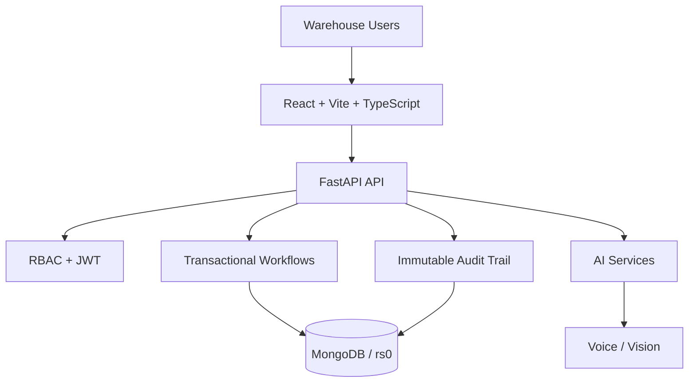

<div align="center">

# WMS — Warehouse Management System

### `REAL-TIME FULFILLMENT OPERATIONS • RBAC • TRANSACTIONS • AI`

A warehouse operations platform designed to replace fragile spreadsheet workflows with a role-secured, transaction-aware system.

**FastAPI** · **MongoDB** · **React** · **TypeScript** · **Vite**

</div>

---

## The problem

Whitfield Fulfillment operates across two warehouses and previously relied on Excel for inventory and order workflows. The system was designed to address duplicate stock entries, concurrent inventory edits, missing auditability, outbound bottlenecks and granular access-control requirements. citeturn9file0

## The solution

WMS centralizes receiving, inventory, storage, orders, approvals, reporting and operational intelligence behind a FastAPI + MongoDB backend and React + Vite client. The backend currently exposes **48+ REST endpoints across 16 domain routers**, covering authentication, users, warehouses, arrivals, tickets, approvals, orders, storage, audit, reports, voice, vision, natural-language queries, API keys, inbox notifications and health checks. citeturn9file0

---

## Architecture



### Engineering decisions

| Concern | Implementation |
|---|---|
| **Authentication** | JWT bearer authentication with role dependencies |
| **Authorization** | `OWNER` · `MANAGER` · `STAFF` |
| **Concurrency** | MongoDB transactions on a replica set configuration |
| **Inventory safety** | Transaction-aware allocation to prevent race-condition overselling |
| **Ticket IDs** | Atomic counter-based sequential generation |
| **Auditability** | Immutable action history with user, facility, timestamp and before/after values |
| **AI** | Natural-language queries, voice/STT and vision inspection |
| **Migration** | Excel ingestion and normalization into MongoDB |

These capabilities are documented in the current implementation. citeturn9file0

---

## Core workflows

### Receiving
`Carrier / Drop-off → Ticket → UPC Scan → Condition → Approval → Inventory`

### Fulfillment
`Order → Allocation → Picking → Packing → Shipping`

### Operations intelligence
`User Query → AI Service → Warehouse Data → Natural-language Response`

### Accountability
`User Action → Audit Event → Immutable History`

---

## What is built

### 📦 Multi-warehouse operations
- Reno, Nevada and Columbus, Ohio facilities
- Real-time/consolidated operational views
- Facility-aware workflows

### 🔐 RBAC & security
- `OWNER`, `MANAGER`, `STAFF` roles
- JWT authentication
- Role-aware navigation and API access

### ⚡ Transaction-safe inventory
- MongoDB `rs0` replica-set configuration
- Multi-document transactions
- Atomic sequential ticket generation
- Order state pipeline: `PENDING → PICKING → PACKED → SHIPPED`

### 📋 Receiving & storage
- UPC barcode lookup
- Incoming quantity and condition logging
- Carrier tracking
- Warehouse bin/shelf placement

### 🤖 AI-assisted operations
- Natural-language warehouse queries
- Speech-to-text hands-free workflows
- Computer-vision inspection
- API-key support for automated worker scripts

### 📊 Reporting & migration
- Warehouse stock and shipping reports
- Legacy Excel migration utility
- Operational notifications and health monitoring

---

## Project structure

```text
WMS/
├── backend/
│   ├── core/
│   │   ├── apis/          # FastAPI app, routers and schemas
│   │   ├── controllers/   # Business logic + transactions
│   │   ├── cruds/         # MongoDB data access
│   │   ├── database/      # Connection + initialization
│   │   ├── models/        # Data models
│   │   ├── services/      # AI / voice / vision integrations
│   │   └── utils/         # Shared utilities
│   ├── commons/           # Auth, logging, exceptions
│   ├── scripts/           # Migration / seeding utilities
│   └── tests/             # Phase + smoke test suites
│
├── frontend/
│   └── src/
│       ├── components/    # UI components
│       ├── lib/           # API client, auth and route protection
│       └── routes/        # Application pages
│
└── cli.py                 # Operational CLI utilities
```

The repository contains dedicated backend tests for phase 01, phase 02+ and smoke verification. citeturn15file0

---

## Run locally

### Backend

```bash
cd backend
python -m venv venv
```

Windows PowerShell:

```powershell
.\venv\Scripts\Activate.ps1
pip install -r requirements.txt
python main.py
```

The backend entry point runs Uvicorn on port `8000`; API documentation is available through FastAPI's `/docs` endpoint when the service is running. citeturn28file0

### Frontend

```bash
cd frontend
npm install
npm run dev
```

---

## Testing

```bash
cd backend
python -m pytest -q

# Focused suites
python -m pytest tests/phase01/ -q
python -m pytest tests/phase02plus/ -q
python -m pytest tests/smoke/ -q
```

---

## Tech stack

**Backend** — Python · FastAPI · Pydantic · MongoDB · Motor · ODMantic · PyJWT · Pytest  
**Frontend** — React · TypeScript · Vite · TanStack Query · Tailwind CSS  
**AI / Automation** — Google GenAI · OpenCV · Voice/STT · Vision  
**Tooling** — Git · Docker · Excel migration · API scripting

---

## Project status

**Built:** core warehouse workflows, RBAC, transaction-aware inventory, auditability, AI-assisted operations, migration tooling and test suites.

**Focus:** continuing to evolve the system toward reliable, observable and automation-friendly warehouse operations.